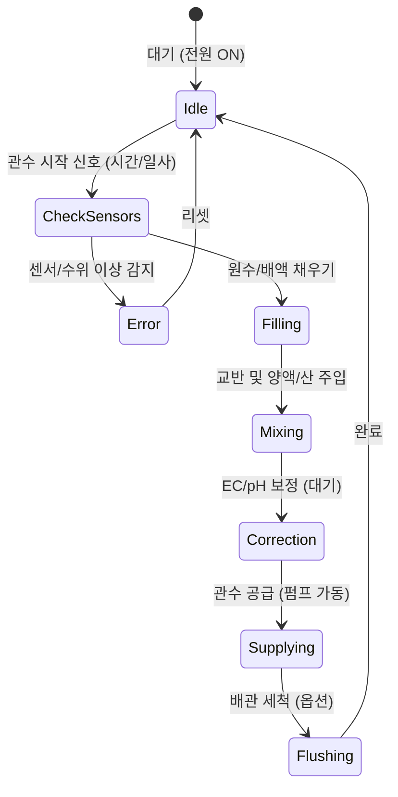

내가 # 스마트팜 양액공급기 제어 알고리즘 (Control Algorithm Specification)
**Project:** KF-NUTRI-2026
**Version:** 1.1
**Date:** 2026-01-06

---

## 1. 시스템 상태 머신 (System State Machine)

시스템은 다음과 같은 주요 상태(State)를 가지며, 조건에 따라 전이한다.



---

## 2. 주요 제어 로직 (Core Logic Modules)

### 2.1 믹싱 및 정밀 농도 제어 (Precision Mixing Control) [Updated V2.0]
시뮬레이터 검증을 통해 **침전 방지** 및 **pH 쇼크 방지** 로직이 강화되었습니다.

*   **⚠️ 침전 방지 안전 장치 (Anti-Precipitation Safety):**
    *   **순차 투입 (Sequential Dosing):** 원수 급수 → **산(Acid) 선투입** (pH 하강으로 용해도 증가) → A액 → B액 순서 권장.
    *   **상호 잠금 (Interlock):** A액 밸브 개방 시 B액 밸브 **강제 차단(Lock)**. 반대의 경우도 동일. (동시 투입 절대 불가)

*   **🧠 스마트 pH 제어 (Smart pH "Wait & Read"):**
    *   **반응 지연 고려:** 산 투입 후 반응 시간(약 30초) 동안 센서 값을 신뢰하지 않고 대기.
    *   **알고리즘:**
        1.  `Pulse Dosing`: 산 밸브 1~2초 개방.
        2.  `Wait State`: **30초간 투입 중단** (교반만 지속).
        3.  `Read`: 안정화된 센서 값 읽기.
        4.  `Check`: 목표 범위(Tolerance) 밖이면 1번 반복.

*   **🚨 비상 희석 로직 (Emergency Dilution - Overshoot Protection) [New V12.0]:**
    *   **목적:** 양액 농도가 실수로 과다 투입(Overshoot)되거나, pH가 너무 낮아진(Acid Overdose) 경우, 자동으로 원수를 투입하여 농도를 낮춥니다.
    *   **발동 조건:** `현재 EC > 목표 EC + 오차범위` 또는 `현재 pH < 목표 pH - 오차범위`
    *   **동작:**
        1.  모든 양액/산 밸브 차단.
        2.  **원수 밸브(Inlet Valve) 개방.**
        3.  상태 표시: `⚠️ DILUTING` (탱크 여유 공간 있음) 또는 `🚨 ALARM: TANK FULL` (여유 공간 없음, 즉시 정지).

*   **알고리즘 (세부):**
    1.  **초기 급수:** 설정된 목표 수위까지 물을 채운다 (원수 + 배액).
    2.  **순환/교반:** 믹싱 펌프를 가동하여 물을 회전시킨다.
    3.  **정밀 주입 (Precision Dosing):**
        *   `우선순위 1` (pH): pH > 6.5 이면 산 선투입 (Wait & Read 적용).
        *   `우선순위 2` (EC): EC < 목표값 이면 A/B액 교차 주입 (Interlock 적용).
        *   *Tip:* 오차 범위(Tolerance, 예: ±0.3) 내에 진입하면 투입을 멈추고 '안정화(Stabilizing)' 상태로 전환.

### 2.2 배액 재활용 로직 (Recycling Strategy)
배액을 무조건 섞는 것이 아니라, 배액의 상태에 따라 혼합 비율을 결정합니다.

*   **입력값:** 배액 탱크 EC (`Drain_EC`), 목표 설정 EC (`Target_EC`)
*   **제어 로직:**
    ```python
    If (Drain_EC > Limit_EC) OR (Drain_Temp > Limit_Temp):
        # 배액 상태가 나쁘면(염류 집적 or 고온) 전량 폐기 또는 사용 안함
        V_3Way_Valve = "Fresh_Water_Only"
    Else:
        # 배액 재사용 (혼합 모드)
        # 예: 전체 물량의 30%를 먼저 배액으로 채우고, 나머지를 원수로 채움
        Target_Drain_Level = Total_Fill_Level * 0.3
        Open_Drain_Pump()
        Wait until (Current_Level >= Target_Drain_Level)
        Stop_Drain_Pump()
        # 나머지는 원수로 채움
        Switch_Valve_To_Fresh()
        Fill_Fresh_Water()
    ```

### 2.3 수온 제어 (Temperature Control - Chiller)
와사비 생육을 위해 수온을 민감하게 관리합니다.

*   **설정값:** 목표 수온 (예: 15℃), 히스테리시스 (예: ±1.0℃)
*   **로직:**
    *   **냉각 시작:** `Current_Temp` > `Target_Temp` + 1.0℃ 이면 → **Chiller ON**
    *   **냉각 중단:** `Current_Temp` <= `Target_Temp` 이면 → **Chiller OFF**
    *   *안전장치:* 믹싱 탱크 수위가 `Low` 이하일 경우, 칠러 가동 강제 중단 (동파/고장 방지).

### 2.4 단별 정밀 공조 제어 (Per-tier Micro-climate Control) [New V1.5]
단별 독립 온습도 센서 데이터를 기반으로 상하단 환경 불균형을 해결합니다.

*   **설정값:** 단별 목표 온도(13°C), 목표 습도(95%)
*   **제어 로직:**
    *   **수직 온도차 보정:** 특정 단의 온도가 타겟보다 1.5°C 높을 경우 → 해당 단 전용 **서큘레이터 가속** 및 **냉기 덕트 댐퍼(Damper) 개도량 증대**.
    *   **국소 다습 방지:** 습도가 98% 이상 정체될 경우 (곰팡이 위험) → 일시적 환기 또는 공기 순환 팬 가동.
    *   **데이터 로깅:** 모든 단의 데이터를 초 단위로 수집하여 'AI 지능형 환경 균일화' 알고리즘의 학습 데이터로 활용.

---

## 3. 운전 시나리오 (Operation Sequence)

### [Scenario] 정규 관수 사이클 (1회)

1.  **시작 트리거 확인 (Start Check)**
    *   설정 시간 도달 OR 누적 일사량(100J) 도달 확인.
    *   시스템 에러(비상정지, 센서오류) 없음 확인.

2.  **믹싱 탱크 준비 (Pre-Mixing)**
    *   [수위 체크] 탱크가 비었는가? → 아니면 있는 물 사용 or 배수.
    *   [급수] 3-Way 밸브 제어 → (배액 30% + 원수 70%) → 목표 수위까지 채움.
    *   [수온 체크] 수온이 18도 이상인가? → 칠러 가동 & 교반 펌프 ON.
    *   [농도 맞춤] 교반하며 A/B/C액 투입 → 목표 EC/pH 도달 시까지 반복.

3.  **구역 공급 (Irrigation Supply)**
    *   목표 구역(Zone 1) 전자 밸브(V1) Open.
    *   메인 공급 펌프(Main Pump) 가동 (인버터 Soft Start).
    *   유량계 적산값 모니터링.
    *   설정된 유량(예: 100L) 도달 시 → 펌프 정지 → 밸브 Close.

4.  **종료 및 대기 (Flush & Idle)**
    *   다음 구역이 있으면 3번 반복.
    *   모든 구역 완료 시 대기 모드로 전환.
    *   (옵션) 하루 마지막 관수 후에는 원수로 배관 세척(Flushing) 수행.

---

## 4. 예외 처리 (Exception Handling)

*   **센서 에러(Sensor Fault):** 주입 중 EC/pH 변화가 1분 이상 없으면 → **"양액 고갈"** 또는 **"센서 고장"** 알람 발생 및 정지.
*   **수위 에러(Level Fault):** 펌프 가동 중 수위 급격히 저하 시 → **"누수 감지"** 알람.
*   **전원 재인가:** 정전 후 복구 시, 이전 실행 중이던 관수 스케줄의 잔여량부터 수행할지, 초기화할지 설정 옵션 확인.
